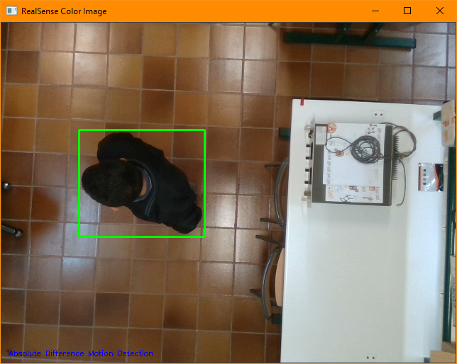
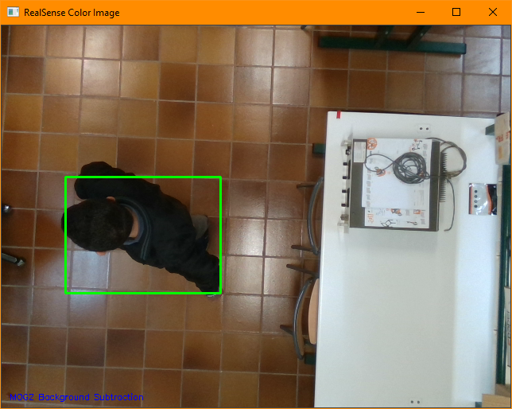
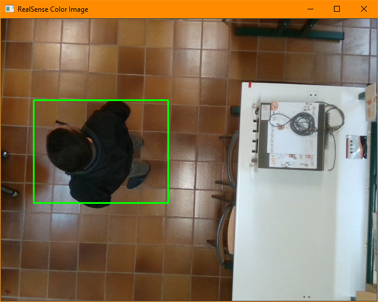

<!-- PROJECT SHIELDS -->
[![Contributors][contributors-shield]][contributors-url]
[![Forks][forks-shield]][forks-url]
[![Stargazers][stars-shield]][stars-url]
[![Issues][issues-shield]][issues-url]
[![CC License][license-shield]][license-url]


<!-- TABLE OF CONTENTS -->
## Table of Contents

- [1. About The Project](#about-the-project)
    * [Built With](#built-with)
- [2. Getting Started](#getting-started)
    * [Prerequisites](#prerequisites)
    * [Installation](#installation)
- [3. Usage](#usage)
    * [Absolute Difference Motion Detection](#absolute-difference-motion-detection)
    * [MOG2 Subtractor Motion Detection](#mog2-subtractor-motion-detection)
    * [CSRT Motion Tracking](#csrt-motion-tracking)
- [4. Roadmap](#roadmap)
- [5. Contributing](#contributing)
- [6. License](#license)
- [7. Contact](#contact)
- [8. Acknowledgements](#acknowledgements)


<!-- ABOUT THE PROJECT -->
## About The Project

The main objective of this work is the development of a security system which allows real time monitoring 
of people's location.

Using a depth camera as well as image processing libraries such as OpenCV, it is proposed to define a safe area where 
a person can move freely, establishing a tracking system with alarm alerts integrated to trigger in cases where he 
could go out of bounds of the risk free enclosure. 


### Built With

* [OpenCV](https://pypi.org/project/opencv-python/)
* [Intel RealSense SDK](https://pypi.org/project/pyrealsense2/)


<!-- GETTING STARTED -->
## Getting Started

To get a local copy up and running follow these simple steps.

### Prerequisites

* pipenv
  ```sh
  pip install pipenv
  ```

### Installation

1. Clone the repo
   ```sh
   git clone https://github.com/alu0101109251/DepthCameraSecuritySystem.git
   ```
2. Install PipEnv packages
   ```sh
   pipenv install
   ```


<!-- USAGE EXAMPLES -->
## Usage

There are 3 main scripts implemented, using different motion detection and tracking techniques.

Depending on the situation and scenario, choose the approach which works better for you.


### Absolute Difference Motion Detection

This method is based on image difference technique.

Using grayscale blurred images, it generates a foreground mask by subtracting the current frame with the background frame.

After that, it applies a threshold to clean up the mask. Then motion contours are found and drawn.

1. Start [`motion_detection_difference.py`](motion_detection_difference.py) script

2. Background selection window will open.
    * Be sure that the monitored area is empty.
    * Select the background model by pressing `SPACE`

3. Motion detection window will open.
    * Now move inside the monitored area to see the detection.
    * Press `Q` to close the program.
    



### MOG2 Subtractor Motion Detection

This method is based on background subtraction.

Using MOG2 Background Subtractor, it generates a foreground mask.

After that, it applies opening and enclosing operations to clean up the mask. Then motion contours are found and drawn.

1. Start [`motion_detection_subtractor.py`](motion_detection_subtractor.py) script

2. Background learning window will open.
    * Be sure that the monitored area is empty.
    * Wait some seconds, so the algorithm can learn the background model.
    * Press `SPACE` to finish.

3. Motion detection window will open.
   * Now move inside the monitored area to see the detection.
    * Press `Q` to close the program.
    



### CSRT Motion Tracking

This method is based on tracking.

Using CSRT Tracker, select the desired object/person to track.

After that, CSRT will track and draw the ROI's bounding box.

1. Start [`motion_tracking.py`](motion_tracking.py) script

2. Press `S` to open the ROI selection window.
    * Select the object you want to track using the mouse.
    * Press `ENTER` to confirm selection or `C` to cancel.

3. Tracking window will open.
    * You can reset and track a new object anytime you want by opening the ROI selection window.
    * Press `Q` to close the program.
    
> NOTE: this method can only track one object at a time. 
No other objects will be detected if you are currently tracking one.




<!-- ROADMAP -->
## Roadmap

See the [open issues](https://github.com/alu0101109251/DepthCameraSecuritySystem/issues) for a list of proposed features (and known issues).


<!-- CONTRIBUTING -->
## Contributing

Contributions are what make the open source community such an amazing place to be learn, inspire, and create. Any contributions you make are **greatly appreciated**.

1. Fork the Project
2. Create your Feature Branch (`git checkout -b feature/AmazingFeature`)
3. Commit your Changes (`git commit -m 'Add some AmazingFeature'`)
4. Push to the Branch (`git push origin feature/AmazingFeature`)
5. Open a Pull Request


<!-- LICENSE -->
## License

Distributed under the _Creative Commons Attribution-ShareAlike 4.0 International License_. 

[![CC BY-SA 4.0][license-img]][license-url]

See [`LICENSE`](LICENSE) for more information.


<!-- CONTACT -->
## Contact

Javier Alonso Delgado  - alu0101109251@ull.edu.es

Project Link: [https://github.com/alu0101109251/DepthCameraSecuritySystem](https://github.com/alu0101109251/DepthCameraSecuritySystem)


<!-- ACKNOWLEDGEMENTS -->
## Acknowledgements

* [numpy](https://numpy.org/)
* [Shields.io](https://img.shields.io/)


<!-- MARKDOWN LINKS & IMAGES -->
[contributors-shield]: https://img.shields.io/github/contributors/alu0101109251/DepthCameraSecuritySystem.svg?style=for-the-badge
[contributors-url]: https://github.com/alu0101109251/DepthCameraSecuritySystem/graphs/contributors
[forks-shield]: https://img.shields.io/github/forks/alu0101109251/DepthCameraSecuritySystem.svg?style=for-the-badge
[forks-url]: https://github.com/alu0101109251/DepthCameraSecuritySystem/network/members
[stars-shield]: https://img.shields.io/github/stars/alu0101109251/DepthCameraSecuritySystem.svg?style=for-the-badge
[stars-url]: https://github.com/alu0101109251/DepthCameraSecuritySystem/stargazers
[issues-shield]: https://img.shields.io/github/issues/alu0101109251/DepthCameraSecuritySystem.svg?style=for-the-badge
[issues-url]: https://github.com/github_username/repo/issues
[license-shield]: https://img.shields.io/github/license/alu0101109251/DepthCameraSecuritySystem.svg?style=for-the-badge
[license-url]: http://creativecommons.org/licenses/by-sa/4.0/
[license-img]: https://licensebuttons.net/l/by-sa/4.0/88x31.png